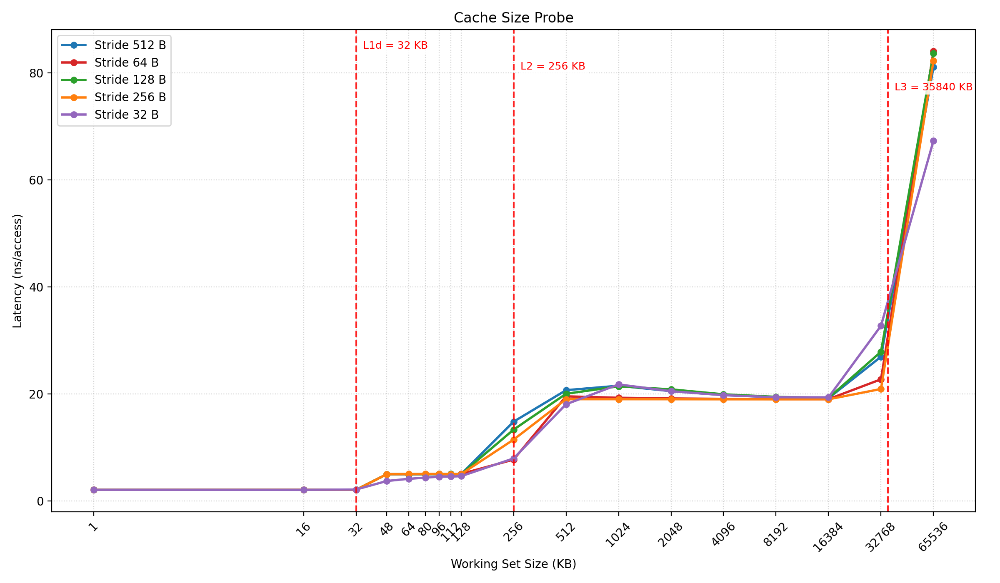
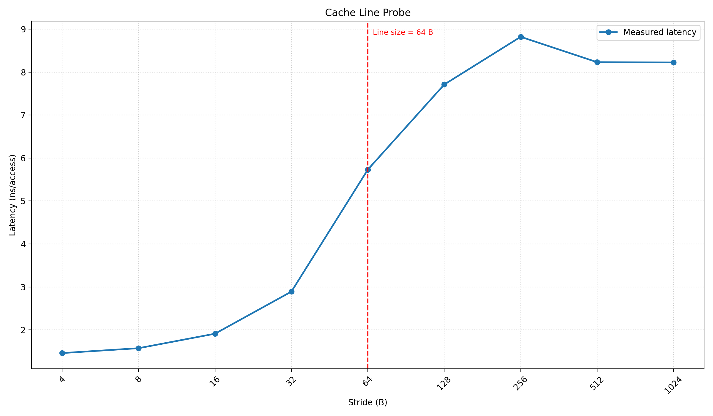
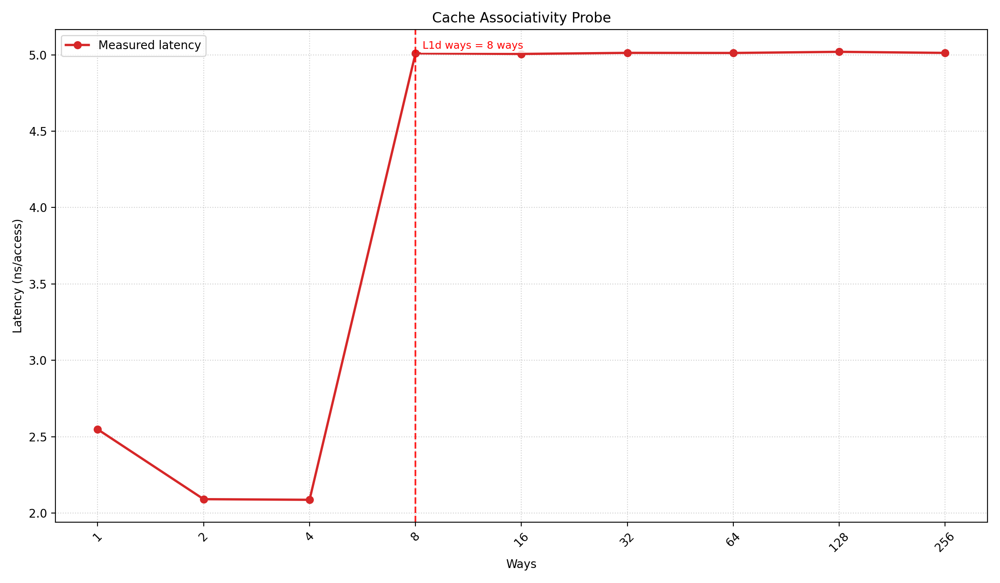

# 缓存测量实验

杜若和 2023012163

## 实验机器的参数

我使用 Intel(R) Xeon(R) CPU E5-2680 v4 平台完成本次实验，单核心具有 32KB 的 L1 DCache，256 KB 的 L2 Cache，Cache Line 大小为 64B。其他数据见下表：

```
$ lscpu --cache
NAME ONE-SIZE ALL-SIZE WAYS TYPE        LEVEL  SETS PHY-LINE COHERENCY-SIZE
L1d       32K     896K    8 Data            1    64        1             64
L1i       32K     896K    8 Instruction     1    64        1             64
L2       256K       7M    8 Unified         2   512        1             64
L3        35M      70M   20 Unified         3 28672        1             6
```

lscpu 详细的运行结果在 `lscpu.log`。

## 文件结构说明

```
.
├── assets          # 实验结果的图表
│   ├── cache_associativity.png
│   ├── cache_line.png
│   └── cache_size.png
├── build           # 编译生成的可执行文件
│   ├── matmul
│   └── probe
├── lscpu.log       # lscpu 的输出结果
├── Makefile
├── matmul.cpp      # 矩阵乘法优化代码
├── plot_results.py # 绘制实验结果图的脚本
├── probe.cpp       # 测量缓存大小、缓存行大小和相联度的代码
├── README.md       # 此报告
├── results         # 实验结果的原始数据
│   ├── results_cache_assoc.txt
│   ├── results_cache_line.txt
│   ├── results_matmul.txt
│   ├── results_stride_128.txt
│   ├── results_stride_16.txt
│   ├── results_stride_32.txt
│   ├── results_stride_64.txt
│   └── results_stride_8.txt
└── run.sh          # 批量运行缓存大小测量的脚本
```

使用 `make` 命令编译生成 `build/probe` 和 `build/matmul` 可执行文件，使用 `./run.sh` 运行缓存大小测量实验，使用 `./build/probe line` 以默认参数运行缓存行大小测量实验，使用 `./build/probe assoc` 以默认参数运行缓存相联度测量实验。使用 `python3 plot_results.py` 绘制实验结果图表。

## 测量缓存大小

### 访存序列

设访存区间大小为 $m$ 字节，步长为 $l$ 字节，$s=\frac{m}{l}$。对集合 $\{0,1,\cdots,s-1\}$ 随机生成一个排列 $\pi_{m,l}$，并将这些位置按该排列串成环，则测量阶段的访存序列可记为 $a_{m,l}(n)=\pi_{m,l}(n \bmod s)\,l$，其中 $n=0,\cdots,\max(2^{20},256s)-1$。

由于下一次访问位置由当前读取出的索引决定，该序列实际以随机指针追逐方式执行，CPU 无法预取下一步的数据，可有效减弱硬件预取的干扰。

### 实验结果

实验结果如图，横轴为缓存工作集大小，纵轴为访存延迟时间，不同曲线表示以不同步长访存，纵向的红线标出了缓存真实的大小。



由图可以看出，在工作集大小超出 Cache 大小时，由于 Cache Miss，发生了明显的访存延迟增加，即出现了“台阶”。L1 DCache 的测量结果与真实值 32KB 匹配，而 L2 Cache 的测量结果略微偏小。

实验结果的原始数据位于 `results/results_stride_*.txt`，每个文件包含了不同步长下的延迟数据。

### 思考题

> 理论上 L2 Cache 的测量与 L1 DCache 没有显著区别。但为什么 L1 DCache 结果匹配但是 L2 Cache 不匹配呢？你的实验有出现这个现象吗？请给出一个合理的解释。
> 
> 提示：DCache v.s. Cache
>

我的实验观察到了与示例相似的现象，32KB 之后的下一个采样点出现了延迟时间上升的台阶，与 L1 DCache 的真实值 32KB 匹配，而 256KB 的采样点已经出现了延迟时间的上升，与 L2 Cache 的真实值 256KB 不匹配，测得的结果偏小。一个合理的解释是，L1 DCache 是数据专用 Cache，而 L2 Cache 是指令和数据共享的 Cache，部分空间会被指令占用，因此数据占据的空间会比标称值小一些，造成额外的 Cache Miss，导致使用我们的方法测量结果偏小。

## 测量缓存行大小

### 访存序列

设访存区间大小为固定值 $m=256\text{ MB}$，步长为 $l$ 字节，则测量阶段的访存序列为 $a_{m,l}(n)=(n\times l)\bmod m$，其中 $n=0,\cdots,2^{24}-1$。

该实验在相同访存次数下仅改变步长 $l$，通过平均访问延迟随 $l$ 的变化来观察 Cache Line 大小。

### 实验结果

实验结果如图，横轴为访问步长，纵轴为访存延迟时间，红线标出了缓存行大小的真实值。



由图可以看出，在访问步长超过 64B 时，访存延迟时间有显著提升，与预期相符。

实验结果的原始数据位于 `results/results_cache_line.txt`。

## 测量缓存的相联度

### 访存序列

设待测 Cache 大小为 $C$ 字节，访存区间大小取为 $m=2C$，并将其划分为 $2^n$ 个块，每块大小为 $b=\frac{m}{2^n}$。记奇数块编号集合为 $S_n=\{1,3,\cdots,2^n-1\}$，对其随机生成一个排列 $\sigma_n$ 并串成环，则测量阶段的访存序列可记为 $a_n(k)=\sigma_n(k \bmod 2^{n-1})\,b$，其中 $k=0,\cdots,2^{24}-1$。

也就是说，实验只访问奇数块的块首地址，并以随机指针追逐方式在这些块之间跳转，通过延迟突增的位置判断相联度。

### 对相联度测量算法的分析

我采取实验思路 1：

- 使用一个 2 倍 Cache Size 大小的数组
- 将数组分为 $2^n$ 个块，只访问其中的奇数块
- 逐渐增大 $n$ 的取值，当某一次访问变慢时，$2^{n-2}$ 就是相联度

设缓存的相联度为 $\text A$，Cache 总大小为 $\text C$。

则，相差为 $\frac{\text C}{\text A}$ 的两个地址，会被映射到同一个 Cache Set 中。

构造大小为 $2 \times \text C$ 的数组，分为 $2^n$ 个块，每个块的大小为 $\frac{2 \times \text C}{2^n} = \frac{\text C}{2^{n-1}}$。只访问奇数块，则相邻两次访问的地址间隔（访问步长）为 $\frac{\text C}{2^{n-2}}$。

当相邻两次访问的地址落到同一个 Cache Set 中时，就会发生竞争，需要将 Cache Line 从 Cache 中替换出去，导致访问变慢。根据这个原理，当 $2^{n-2} = \text A$ 时，就会发生访问变慢的现象，因此 $2^{n-2}$ 就是相联度。

### 实验结果

实验结果如图，横轴为 $2^{n-2}$ 的值，纵轴为访存延迟时间，红线标出了相联度的真实值。



由图可以看出，在 $n=5, 2^{n-2} = 8$ 时，访问延迟时间有显著提升，与预期相符。

## 优化矩阵乘法程序

我的优化如下：


``` cpp
//======================================================
int (*bt)[MATRIX_SIZE] = new int[MATRIX_SIZE][MATRIX_SIZE];

#define BLOCK_I 16
#define BLOCK_J 16

for (i = 0; i < MATRIX_SIZE; i ++)
    for (j = 0; j < MATRIX_SIZE; j ++)
        bt[j][i] = b[i][j];

for (int ii = 0; ii < MATRIX_SIZE; ii += BLOCK_I) {
    for (i = ii; i < ii + BLOCK_I; i ++) {
        for (int jj = 0; jj < MATRIX_SIZE; jj += BLOCK_J) {
            for (j = jj; j < jj + BLOCK_J; j ++) {
                register int sum = 0;
                for (k = 0; k < MATRIX_SIZE; k ++)
                    sum += a[i][k] * bt[j][k];
                d[i][j] = sum;
            }
        }
    }
}
// Stop here.
//======================================================
```

主要有以下优化点：

- 将矩阵 b 转置存储到 bt 中，把原来的按列访问变成按行访问，提升 Cache 命中率
- 循环改为二维分块访问，提升局部性，使得每次访问的数据尽量留在 Cache 中
- 循环最内层使用寄存器变量 sum 来存储累加结果，最后一次写回内存，减少内存访问次数

此优化方式在大部分 CPU 上可以做到加速比稳定大于 3。我在我的实验环境上连续运行了 5 次，log 位于 `results/results_matmul.txt`。

## 对本次实验的意见和建议

建议提供统一的实验平台。在一些新款的处理器，和使用虚拟化技术构建的云服务器平台上，使用实验手册中的简单方法往往难以测出效果良好且令人信服的数据。
